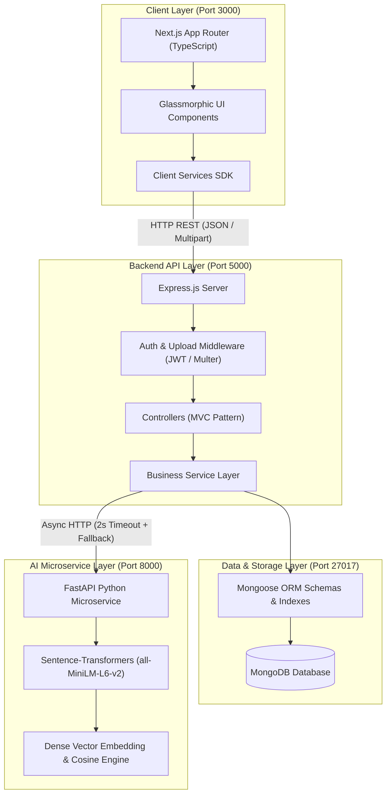
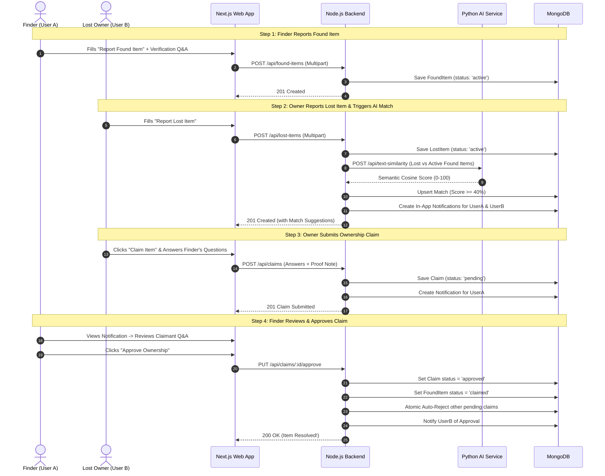
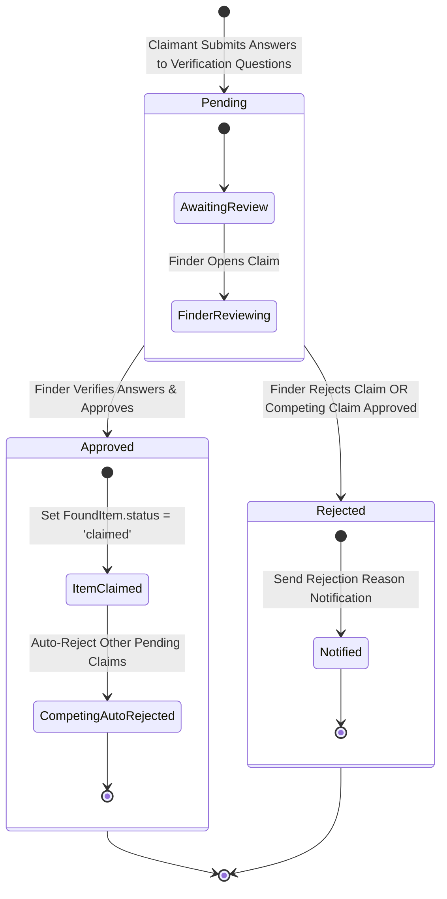
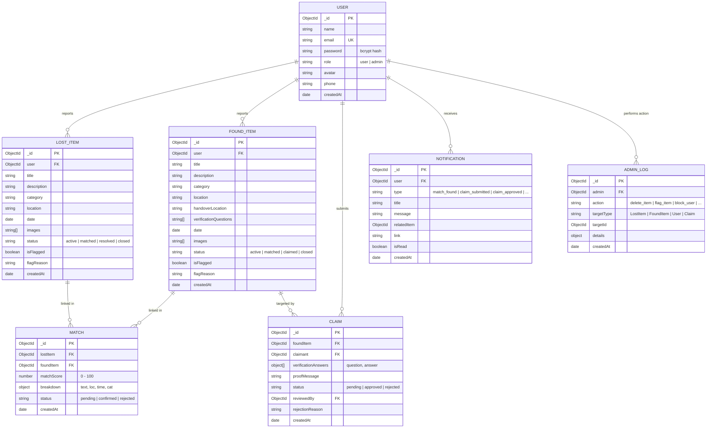
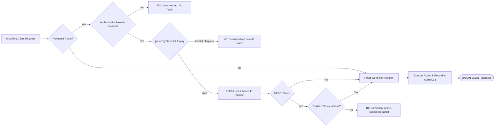

# 🏛️ Retrivo — System Architecture & Flowcharts

This document contains complete visual architecture diagrams, user journey flows, matching engine pipelines, and database entity relationships for **Retrivo (AI-Powered Lost & Found Platform)**. All diagrams are formatted using standard [Mermaid.js](https://mermaid.js.org/) and render natively on GitHub.

---

## 📑 Table of Contents
1. [High-Level System Architecture](#1-high-level-system-architecture)
2. [End-to-End User Journey Flowchart](#2-end-to-end-user-journey-flowchart)
3. [4-Factor AI Matching Engine Pipeline](#3-4-factor-ai-matching-engine-pipeline)
4. [Ownership Verification & Claim State Machine](#4-ownership-verification--claim-state-machine)
5. [Database Schema & Entity Relationship Diagram (ERD)](#5-database-schema--entity-relationship-diagram-erd)
6. [Security & Authentication Middleware Flow](#6-security--authentication-middleware-flow)

---

## 1. High-Level System Architecture



---

## 2. End-to-End User Journey Flowchart



---

## 3. 4-Factor AI Matching Engine Pipeline

```mermaid
flowchart TD
    Start([New Lost/Found Item Event]) --> FetchPool[Fetch Active Candidate Items from DB]
    
    FetchPool --> Factor1[1. Category Check (Weight: 25%)]
    FetchPool --> Factor2[2. Semantic Text Engine (Weight: 30%)]
    FetchPool --> Factor3[3. Location Proximity (Weight: 25%)]
    FetchPool --> Factor4[4. Time Decay Factor (Weight: 20%)]

    Factor1 --> |Exact Match: 100 / Mismatch: 0| CalcComposite
    
    Factor2 --> CallAI{FastAPI Available?}
    CallAI -->|Yes| TransformerScore[all-MiniLM-L6-v2 Cosine Similarity]
    CallAI -->|No / Timeout > 2s| FallbackScore[Tokenized Word Jaccard + Substring Boost]
    TransformerScore --> CalcComposite
    FallbackScore --> CalcComposite

    Factor3 --> TokenOverlap[Token Overlap & Substring Match]
    TokenOverlap --> CalcComposite

    Factor4 --> LinearDecay[Max(0, 100 - DaysDiff × 5%)]
    LinearDecay --> CalcComposite

    CalcComposite[Composite Score Formula:\n0.25*Cat + 0.30*Text + 0.25*Loc + 0.20*Time] --> SanityCheck{Category Match?}
    SanityCheck -->|No| CapScore[Cap Total Score at 30%]
    SanityCheck -->|Yes| RawScore[Final Score 0 - 100%]
    
    CapScore --> ThresholdCheck{Score >= 40%?}
    RawScore --> ThresholdCheck
    
    ThresholdCheck -->|Yes| SaveMatch[Upsert Match in DB & Dispatch Alerts]
    ThresholdCheck -->|No| Discard[Ignore Sub-Threshold Candidate]
```

---

## 4. Ownership Verification & Claim State Machine



---

## 5. Database Schema & Entity Relationship Diagram (ERD)



---

## 6. Security & Authentication Middleware Flow


